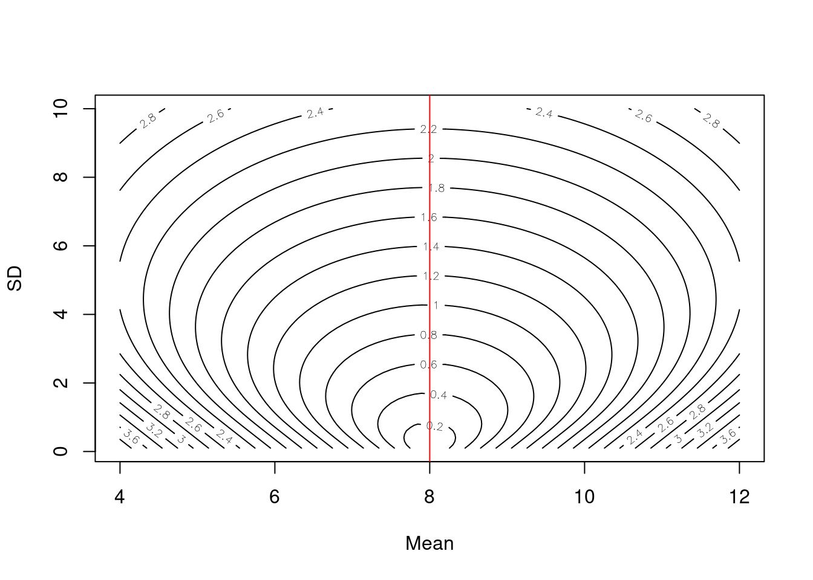
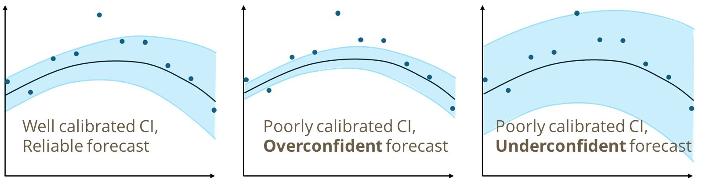

```{r setup, include=FALSE}
knitr::opts_chunk$set(echo = TRUE)
```

# Background on forecast evaluation

**So, you made a forecast of future ecological conditions - now what?**

Forecast evaluation is a crucial step in the iterative ecological forecasting cycle, helping to understand the strengths and weaknesses in our forecasting approaches. Comparison of model predictions and forecasts with observations can inform future model states through data assimilation, modify model configurations through model structure changes, and synthesise our understanding of predictability at different spatial, temporal, and ecological scales.

These workshop materials will take you through some simple forecast evaluation exercises, using the NEON Forecast Challenge catalog of scores (forecast evaluation metrics). The exercises are based on experiences and methods employed by the original workshop leads and additional resources on forecast evaluation is included throughout for further reading.

------------------------------------------------------------------------

# This tutorial

```{r required-packages, message=FALSE, warning=FALSE}
library(tidyverse)
library(arrow)
library(kableExtra)

# if you need to download either of these packages uncomment this line!
# install.packages(c('tidyverse','arrow'))
```

------------------------------------------------------------------------

# Accessing NEON catalog

Here, we provide a quick introduction to the EFI-NEON Forecast Challenge catalog, which will be used to demonstrate forecast evaluation methods and approaches. A more in-depth look at the NEON forecasts from the Challenge can be found in the [Get_scores_tutorial](https://github.com/eco4cast/NEON-forecast-challenge-workshop/tree/main/Analyse_scores) as part of the [NEON Forecast Challenge Workshop](https://github.com/eco4cast/NEON-forecast-challenge-workshop/).

> The EFI-NEON Forecast Challenge is an open-source platform for teams and individuals to generate real-time ecological forecasts of a range of ecological variables (communities, populations, phenology, fluxes, and states) in both terrestrial and aquatic systems. More information on the Challenge can be found on the [Challenge website](https://projects.ecoforecast.org/neon4cast-ci/).
>
> The Challenge has been operating since 2021 and submissions are on-going across all five themes (beetles, ticks, phenology, terrestrial fluxes, aquatic water quality), contributing to a number of forecast synthesis projects and educational materials. See references and resources.

We will use the catalog of forecasts and scores from the NEON Challenge. The full catalog can be found on a [STAC catalog](https://radiantearth.github.io/stac-browser/#/external/raw.githubusercontent.com/eco4cast/neon4cast-ci/main/catalog/catalog.json) developed by Challenge organizers. In here you can navigate to one of the sections (e.g. Scores/Forecasts/...) and access the catalog. Using Assets \> Database access \> Copy URL for S3 you can then download forecast information into R.

Below, we use the `URL for S3` for the scores and then using functions from the `arrow` package to connect to the location of the scores on an AWS bucket, subsetting, and then bringing the data locally in R.

For this first set of examples we will use forecasts and scores from the phenology theme of the Challenge on the green up of foliage in a range of terrestrial habitats. These forecasts are for the greenness of plants (G~CC~, or green chromatic coordinate) as estimated using PhenoCam images from NEON sites. More information on the data used in this theme can be found in [Challenge documentation](https://projects.ecoforecast.org/neon4cast-docs/Phenology.html). You would access the phenology scores as follows

```{r accessing-catalog1, eval=FALSE}

phenology_scores_s3 <- "s3://anonymous@bio230014-bucket01/challenges/scores/bundled-parquet/project_id=neon4cast/duration=P1D/variable=gcc_90?endpoint_override=sdsc.osn.xsede.org"

phenology_scores <- arrow::open_dataset(phenology_scores_s3) |> 
  collect()
```

This can be time consuming so we won't run it for now. We can use different dplyr verbs from tidyverse to query the dataset that we've opened before using the `collect()` function to collect that data into our local environment. For example, if you wanted to know what all the sites were in this forecast you could use `distinct()` before the collect.

> Note: We are using the "scores" rather than "forecasts" for this because it contains the observations as well as the forecasts distributions. Changing "scores" to "forecasts" in the above s3 URL (e.g., "phenology_forecasts_s3") would get you the raw forecast submissions.

------------------------------------------------------------------------

# Calculating and plotting evaluation metrics

## Evaluating a forecast from a single reference date

We will start by looking at a single 35-day ahead forecast from a single model and a single site.

```{r access-catalog2}
phenology_scores_s3 <- "s3://anonymous@bio230014-bucket01/challenges/scores/bundled-parquet/project_id=neon4cast/duration=P1D/variable=gcc_90?endpoint_override=sdsc.osn.xsede.org"

model_id_subset <- 'UCSC_P_EDM'
site_id_subset <- 'HARV'
reference_date_subset <- as_datetime('2021-05-01 00:00:00')

single_forecast <- arrow::open_dataset(phenology_scores_s3) |> 
  dplyr::filter(model_id == model_id_subset,
                site_id == site_id_subset,
                reference_datetime == reference_date_subset) |> 
  collect() |> 
  distinct()

glimpse(single_forecast)
```

A plot of this forecast (median + 95% CI), looks like this:

```{r single-forecast}
single_forecast |> 
  ggplot(aes(x=datetime)) +
  geom_ribbon(aes(ymax = quantile97.5, ymin = quantile02.5), alpha = 0.3) +
  geom_line(aes(y = mean)) +
  ylab(expression(bold(G[CC])))
```

We can plot the mean prediction (solid line) compared to the observations (points) as a visual starting point for evaluating that forecast.

```{r single-forecast-plot}
ggplot(single_forecast, aes(x=datetime)) +
  geom_line(aes(y = mean)) +
  geom_point(aes(y = observation))+
  ylab(expression(bold(G[CC])))
```

We see that initially the forecast mean is close to the observations but as we get further into the future the forecast is less good. But how "less good" is it? We can use a variety of scoring metrics to evaluate the forecasts.

### Point forecast evaluation

#### Bias

The first way we could evaluate the forecast is by looking at the difference between the mean prediction and the observed greenness - the forecast error or bias.

```{r error-eval}
single_forecast |> 
  mutate(.by = c(datetime, reference_datetime, model_id, site_id),
         error = mean - observation,
         abs_error = abs(mean - observation),
         sq_error = (mean - observation)^2) |> 
  select(datetime, reference_datetime, model_id, site_id, error, abs_error, sq_error) |> 
  pivot_longer(cols = error:sq_error, names_to = 'eval_metric', values_to = 'score') |> 
  mutate(eval_metric = fct_relevel(eval_metric, "error", "abs_error", "sq_error"))|>
  ggplot(aes(x=datetime, y=score)) +
  geom_line() +
  facet_wrap(~eval_metric)
```

```{r rmse-eval}
single_forecast |> 
  mutate(.by = c(datetime, reference_datetime, model_id, site_id),
         error = mean - observation,
         abs_error = abs(mean - observation),
         sq_error = (mean - observation)^2) |> 
  select(datetime, reference_datetime, model_id, site_id, error, abs_error, sq_error) |> 
  group_by(reference_datetime, model_id, site_id) |> 
  summarise(rmse = sqrt(mean(sq_error)),
            mae = mean(abs_error),
            .groups = 'drop')
```

### Probabilistic forecast evaluation

But, remember these forecasts are probabilistic. They also include an estimation of uncertainty. The errors in the example forecast are assumed to be normally distributed so the uncertainty can be represented by a standard deviation. The scores also include the predictive intervals based on the distribution specified in the forecast.

#### Forecast spread

Looking at the spread or variance in the forecast will evaluate the precision of the forecast. A forecast with high variance is unlikely to be useful for decision making.

```{r}
single_forecast |> 
  ggplot(aes(x = datetime)) +
  geom_line(aes(y = sd))
```
Plotting the forecast with its predictive intervals as well as the observations starts to show us the performance of the whole forecast distribution relative to the observations:

```{r}
single_forecast |> 
  ggplot(aes(x=datetime)) +
  geom_ribbon(aes(ymax = quantile97.5, ymin = quantile02.5), alpha = 0.3) +
  geom_line(aes(y = mean)) +
  geom_point(aes(y = observation)) +
  ylab(expression(bold(G[CC])))
```

We see that for this model, there is little change in the spread of the forecast across the horizon.

#### Continuous Rank Probability Score

The continuous rank probability score, CRPS, is a scoring metric that accounts for both the accuracy and precision of the forecast presented as a distribution [@Gneiting2007] by comparing with an observation. Considering both accuracy and precision is important because a forecast that has a correct mean but large uncertainty should have a lower score than a forecast that is only slightly off but lower uncertainty. Using CRPS, a forecast can score equally well by being slightly less accurate but more precise. A very bad score would come from being overly confident (high precision) about an inaccurate forecast. We use the convention for CRPS where zero is the lowest possible and best score.

Another similar metric is the ignorance or logarithic (log) score [@Jordan2019; @Smith2015], which is also included in the scores table.



The figure above highlights the trade-off between mean and standard deviation, with each isocline having the same CRPS.

CRPS is calculated as part of the NEON Challenge scoring and included in the catalog. We can plot this in the same way as the other metrics.

```{r plotting-crps}
single_forecast |> 
  ggplot(aes(x = datetime, y = crps)) +
  geom_line()
```

Similar to our other metrics we observe an increase in CRPS at some intermediate dates. The lowest score (highest performance) is at the shortest horizon (dates closer to the forecast generation).

#### Prediction interval reliability

By plotting the 95% PE we can check whether model uncertainty is well calibrated (does the forecast distribution match the observed frequency distribution). A forecast that has perfectly reliable CIs will have the equivalent proportion of the observations falling within the CI. Models that produce many forecasts with observations outside the 95% prediction interval are overconfident, and those that have \>\>95% of the observations inside the 95% prediction interval are under-confident.



For our single reference date analysis we could look at whether each observations falls inside or outside the forecast intervals.

```{r reliability}
single_forecast |> 
  mutate(within_PI = between(observation, quantile02.5, quantile97.5)) |> 
  select(model_id, site_id, datetime, observation, quantile10, quantile90, within_PI) |> 
  group_by(model_id, site_id, within_PI) |> 
  summarise(n = n(), 
            .groups = 'drop') |> 
  pivot_wider(names_from = within_PI, names_prefix = 'within_', values_from = n, values_fill = 0) |> 
  mutate(observed_frequency = within_TRUE/(within_FALSE + within_TRUE)*100) 
```

For this particular forecast it seems they are pretty good! If we had additional forecasts we could look at how the reliability of the intervals varies at different horizons.

## Evaluating multiple forecasts

This is a useful starting point for thinking about evaluation metrics. However, we can begin to learn more by evaluating more forecasts and beginning to gain understanding on the general patterns or to make comparisons among models.

1.  Comparing more forecasts from the same model - do the patterns we have observed in the single forecast evaluation hold for more forecasts. We can start to ask questions about the overall predictability of the variable using this model. Maybe this performance we observed was just a one off or maybe it is part of a pattern. We can only start to answer these questions by evaluating more forecasts.

2.  Comparing forecasts from different models - how does our model compare to other model forecasts? These comparisons could be done with models with different configurations or parameters in a model selection framework or as a way to learn about predictability among models. One useful comparison is to compare forecast scores with those produces by a null or baseline model, calculating a relative skill.

### Finding patterns in model evaluation

We can't draw many conclusions from one forecast (n = 1) but perhaps by looking at more forecasts we can start identify patterns of predictability. We will omit the `reference_date_subset` step and instead get all the forecasts generated at `HARV` by `UCSC_P_EDM`.

```{r accessing-catalog3}

model_id_subset <- 'UCSC_P_EDM'
site_id_subset <- 'HARV'

multiple_forecasts <- arrow::open_dataset(phenology_scores_s3) |> 
  dplyr::filter(model_id == model_id_subset,
                site_id == site_id_subset) |> 
  collect() |> 
  distinct()

```

For this example, we have `r length(unique(multiple_forecasts$reference_datetime))` forecasts in the sample, from which we might be able to draw more conclusions about the general patterns of predictability. We can generate the same plots as above for bias and crps but now we can summarise the performance metrics.

Firstly, we can look at how the performance varies by lead time (or horizon). To do this we need to first calculate the horizon for each date, which will vary by when the forecast was generated. For example a forecast for January 30th has a lead time or horizon of 1 day for a forecast with a reference_datetime of January 29th and a horizon of 10 days when the forecast was generated on January 20th. Therefore we can calculate the horizon as the difference between the reference_datetime and the datetime.

```{r calc-horizon}
multiple_forecasts <- multiple_forecasts |> 
  mutate(horizon = as.numeric(as_date(datetime) - as_date(reference_datetime))) |> 
  filter(between(horizon, 1, 30)) 
```

We can then summarise some of our metrics across horizon, to see how generally the model performs at different times into the future. Below we calculate the mae, rmse, and crps (from the pre-scored column in the scores).

```{r scores-by-horizon}

multiple_forecasts |> 
  mutate(abs_error = abs(mean - observation), 
         sq_error = (mean - observation)^2) |> 
  select(horizon, reference_datetime, model_id, site_id, abs_error, sq_error, crps) |> 
  group_by(horizon, model_id, site_id) |> 
  summarise(rmse = sqrt(mean(sq_error, na.rm = T)),
            mae = mean(abs_error, na.rm = T),
            crps = mean(crps, na.rm = T),
            .groups = 'drop') |> 
  pivot_longer(cols = rmse:crps, names_to = 'eval_metric', values_to = 'score') |> 
  
  ggplot(aes(x = horizon, y = score)) +
  geom_line() +
  facet_wrap(~eval_metric)

```

We see that each of the performance metrics increases (forecast performance reduces) at longer horizons.
We can also calculate the reliability of the CI at each horizon across these same forecasts to see if there are any patterns?

```{r reliability-by-horizon}
multiple_forecasts |> 
  mutate(within_PI = between(observation, quantile02.5, quantile97.5)) |> 
  select(model_id, site_id, reference_datetime, horizon, within_PI) |> 
  group_by(model_id, site_id, horizon, within_PI) |> 
  summarise(n = n(), 
            .groups = 'drop') |> 
  pivot_wider(names_from = within_PI, names_prefix = 'within_', values_from = n, values_fill = 0) |> 
  mutate(observed_frequency = within_TRUE/(within_FALSE + within_TRUE)*100) |> 
  ggplot(aes(x=horizon, y=observed_frequency, colour = site_id)) +
  geom_line() +
  geom_hline(yintercept = 95, linetype = 'dashed') +
  annotate('text', label = 'underconfident', x = 5, y= 96) +
  annotate('text', label = 'overconfident', x = 5, y= 94)
```
It seems that generally the forecasts are slightly underconfident at the shorter horizons (more than 95% of observations falling within the 95% CI) but slightly overconfident at the longer horizons (less than 95% of observations falling within the 95% CI) but generally seem well calibrated.

We could also see if we observed the same patterns at another site. `HARV` is a deciduous forest, but do we see the same at `CLBJ`, a south plains grassland-oak forest mosaic?

```{r access-catalog4}
model_id_subset <- 'UCSC_P_EDM'
site_id_subset <- c('HARV', 'CLBJ')

multi_site_forecasts <- arrow::open_dataset(phenology_scores_s3) |> 
  dplyr::filter(model_id == model_id_subset,
                site_id %in% site_id_subset) |> 
  collect() |> 
  distinct() 

multi_site_forecasts |> 
  mutate(horizon = as.numeric(as_date(datetime) - as_date(reference_datetime))) |> 
  filter(between(horizon, 1,30))  |> 
  mutate(abs_error = abs(mean - observation), 
         sq_error = (mean - observation)^2) |> 
  select(horizon, reference_datetime, model_id, site_id, abs_error, sq_error, crps) |> 
  group_by(horizon, model_id, site_id) |> 
  summarise(rmse = sqrt(mean(sq_error, na.rm = T)),
            mae = mean(abs_error, na.rm = T),
            crps = mean(crps, na.rm = T), 
            .groups = 'drop') |> 
  pivot_longer(cols = rmse:crps, names_to = 'eval_metric', values_to = 'score') |> 
  
  ggplot(aes(x = horizon, y = score, colour = site_id)) +
  geom_line() +
  facet_wrap(~eval_metric)

# reliability
multi_site_forecasts |> 
  mutate(horizon = as.numeric(as_date(datetime) - as_date(reference_datetime)),
         within_PI = between(observation, quantile02.5, quantile97.5)) |> 
  filter(between(horizon, 1,30))  |> 
  select(model_id, site_id, reference_datetime, horizon, within_PI) |> 
  group_by(model_id, site_id, horizon, within_PI) |> 
  summarise(n = n(), 
            .groups = 'drop') |> 
  pivot_wider(names_from = within_PI, names_prefix = 'within_', values_from = n, values_fill = 0) |> 
  mutate(observed_frequency = within_TRUE/(within_FALSE + within_TRUE)*100) |> 
  ggplot(aes(x=horizon, y=observed_frequency, colour = site_id)) +
  geom_line() +
  geom_hline(yintercept = 95, linetype = 'dashed') +
  annotate('text', label = 'underconfident', x = 5, y= 96) +
  annotate('text', label = 'overconfident', x = 5, y= 94)

```

We see that the performance at CLBJ (Lyndon B. Johnson National Grassland, Texas) is higher than at HARV (Harvard Forest, Massachusetts) and that the CLBJ forecasts are consistently underconfident. 

Another way we could look at these scores is to see how the performance varies by time of year. Perhaps we are better at particular times of year at different horizons. Below we summarise the scores by horizon and date of forecast generation. For simplicity we will look just at one site.

```{r}
multiple_forecasts |> 
  select(horizon, datetime, model_id, site_id, crps) |>
  
  filter(horizon %in% c(1,7,14,30),
         year(datetime) == 2021) |>
  
  ggplot(aes(x = datetime, y = crps)) +
  geom_line() + 
  facet_wrap(~horizon, labeller = label_both)
```

On this plot we see an increase in CRPS from April (as the leaves come out) and distinct peak in May/June (probably around peak greenness), and this is even more pronounced at longer horizons. There is a second peak in the fall when leaf off occurs. More research questions could be asked about why particular sites and times of year are more or less predictability, but for now we'll move on to seeing if these patterns are consistent across models!

### Comparing forecasts from different models

We will extract a second model's forecasts for the Harvard forest greenness - the `PEG` model. 

```{r model-comp}
model_id_subset <- c('UCSC_P_EDM', 'PEG')
site_id_subset <- 'HARV'

multi_model_forecasts <- arrow::open_dataset(phenology_scores_s3) |> 
  dplyr::filter(model_id %in% model_id_subset,
                site_id == site_id_subset) |> 
  collect() |> 
  distinct()

multi_model_forecasts |> 
  mutate(horizon = as.numeric(as_date(datetime) - as_date(reference_datetime)),
         abs_error = abs(mean - observation), 
         sq_error = (mean - observation)^2) |>   
  filter(between(horizon, 1,30))  |> 
  select(horizon, reference_datetime, model_id, site_id, abs_error, sq_error, crps) |> 
  group_by(horizon, model_id, site_id) |> 
  summarise(rmse = sqrt(mean(sq_error, na.rm = T)),
            mae = mean(abs_error, na.rm = T),
            crps = mean(crps, na.rm = T),
            .groups = 'drop') |> 
  pivot_longer(cols = rmse:crps, names_to = 'eval_metric', values_to = 'score') |> 
  
  ggplot(aes(x = horizon, y = score, colour = model_id)) +
  geom_line() +
  facet_wrap(~eval_metric)

```
Both models see increasing scores at longer forecast horizons. The UCSC_P_EDM has lower CRPS for the majority of the forecast. For MAE and CRPS the UCSC_P_EDM degrades a little faster than the PEG model and actually exceeds PEG using MAE at around 16 days. 


```{r model-comp2}
multi_model_forecasts |> 
  mutate(horizon = as.numeric(as_date(datetime) - as_date(reference_datetime)),
         within_PI = between(observation, quantile02.5, quantile97.5)) |> 
  filter(between(horizon, 1,30))  |> 
  select(model_id, site_id, reference_datetime, horizon, within_PI) |> 
  group_by(model_id, site_id, horizon, within_PI) |> 
  summarise(n = n(), 
            .groups = 'drop') |> 
  pivot_wider(names_from = within_PI, names_prefix = 'within_', values_from = n, values_fill = 0) |> 
  mutate(observed_frequency = within_TRUE/(within_FALSE + within_TRUE)*100) |> 
  ggplot(aes(x=horizon, y=observed_frequency, colour = model_id)) +
  geom_line() +
  geom_hline(yintercept = 95, linetype = 'dashed') +
  annotate('text', label = 'underconfident', x = 5, y= 96) +
  annotate('text', label = 'overconfident', x = 5, y= 94)
```

For the forecast interval reliability, the PEG model is overconfident at all horizons! This suggests that maybe it needs additional calibration or is not representing uncertainty sufficiently.

### Skill scores

A particularly useful comparison could be between your model of interest and a null or baseline model, following best practices [@Lewis2022]. Comparing with a null model gives use some information about how much extra performance you gain (or not!) above a simple null model. From these comparisons with null models we can generate a forecast skill score. There are a few different ways to calculate these but they all basically calculate the difference in score (of whichever metric you choose) between the two. We will use the simplest metric using CRPS (model_crps - null_crps).

We will need to grab the null model forecasts for this variable and site. We will use the climatology forecast as a reasonable baseline for the greening up process for terrestrial sites.

```{r access-catalog5}
model_id_subset <-  c('climatology')
site_id_subset <- 'HARV'

null_model_forecasts <- arrow::open_dataset(phenology_scores_s3) |> 
  dplyr::filter(model_id %in% model_id_subset,
                site_id == site_id_subset) |> 
  collect() |> 
  group_by(reference_datetime, datetime, variable, model_id) |> 
  slice_head(n=1) |> ungroup()

```

We will compare our model of interest `UCSC_P_EDM` to the null by joining them together and looking at the difference between the scores. As calculated, a positive difference implies better performance of the climatology null model.

```{r calc-skill}
bind_rows(null_model_forecasts, multiple_forecasts) |>
  select(model_id, reference_datetime, datetime, crps) |> 
  pivot_wider(names_from = model_id, 
              values_from = crps) |> 
  mutate(skill =  climatology - UCSC_P_EDM,
         horizon = as.numeric(as_date(datetime) - as_date(reference_datetime))) |>
  group_by(horizon) |> 
  summarise(skill = mean(skill, na.rm = T), groups = 'drop') |> 
  filter(between(horizon, 1, 30)) |> 
  ggplot(aes(x = horizon)) +
  geom_line(aes(y = skill)) +
  geom_hline(yintercept = 0) +
  annotate('text', x = 5, y = -0.001, label = 'null better') +
  annotate('text', x=5, y = 0.001, label = 'model better') 


```

At no horizon is our model of interest, on average, better than the null model :( Further evaluation could look at other models and sites in the same way we have done above!

For the aquatics challenge variables, here surface water temperature (`temperature`), we can do the same set of analyses!

1.  Access catalog
2.  Calculate average performance by horizon
3.  Plot average performance by horizon
4.  Plot forecast reliability

```{r aquatic-example}
# 1. Access catalog
aquatic_scores_s3 <- "s3://anonymous@bio230014-bucket01/challenges/scores/bundled-parquet/project_id=neon4cast/duration=P1D/variable=temperature?endpoint_override=sdsc.osn.xsede.org"

model_id_subset <-  c('climatology', 'flareGLM')
site_id_subset <- 'BARC'

aquatic_forecasts <- arrow::open_dataset(aquatic_scores_s3) |> 
  dplyr::filter(model_id %in% model_id_subset,
                site_id == site_id_subset) |> 
  collect() |> 
  group_by(reference_datetime, datetime, variable, model_id) |> 
  slice_head(n=1) |> ungroup()

# 2. calculate average evaluation metrics
aquatic_forecasts |> 
  mutate(horizon = as.numeric(as_date(datetime) - as_date(reference_datetime)),
         abs_error = abs(mean - observation), 
         sq_error = (mean - observation)^2) |>   
  filter(between(horizon, 1,30),
         model_id == 'flareGLM')  |> 
  select(horizon, reference_datetime, model_id, site_id, abs_error, sq_error, crps) |> 
  group_by(horizon, model_id, site_id) |> 
  summarise(rmse = sqrt(mean(sq_error, na.rm = T)),
            mae = mean(abs_error, na.rm = T),
            crps = mean(crps, na.rm = T),
            .groups = 'drop') |> 
  pivot_longer(cols = rmse:crps, names_to = 'eval_metric', values_to = 'score') |> 
  
  
# 3. plot evaluation metrics  
  ggplot(aes(x = horizon, y = score, colour = model_id)) +
  geom_line() +
  facet_wrap(~eval_metric)

# 4. plot the forecast interval reliability

# reliability
aquatic_forecasts |> 
  mutate(horizon = as.numeric(as_date(datetime) - as_date(reference_datetime)),
         within_PI = between(observation, quantile02.5, quantile97.5)) |> 
  filter(between(horizon, 1,30),
         model_id == 'flareGLM')  |> 
  select(model_id, site_id, reference_datetime, horizon, within_PI) |> 
  group_by(model_id, site_id, horizon, within_PI) |> 
  summarise(n = n(), 
            .groups = 'drop') |> 
  pivot_wider(names_from = within_PI, names_prefix = 'within_', values_from = n, values_fill = 0) |> 
  mutate(observed_frequency = within_TRUE/(within_FALSE + within_TRUE)*100) |> 
  ggplot(aes(x=horizon, y=observed_frequency, colour = model_id)) +
  geom_line() +
  geom_hline(yintercept = 95, linetype = 'dashed') +
  annotate('text', label = 'underconfident', x = 5, y= 96) +
  annotate('text', label = 'overconfident', x = 5, y= 94)
```

We see the same pattern of higher metrics (lower performance) as horizon increases. The forecast also seems fairly well calibrated but becomes fairly underconfident at the longest horizons. What about comparing the scores to our null climatology model?

5.  Compare with a null model (skill scores)

```{r aquatic-scores}
# 4. calculate skill relative to null
aquatic_forecasts |>
  select(model_id, reference_datetime, datetime, crps) |> 
  pivot_wider(names_from = model_id, 
              values_from = crps) |> 
  mutate(skill = climatology - flareGLM,
         horizon = as.numeric(as_date(datetime) - as_date(reference_datetime))) |>
  
  # what is the average skill over horizon
  group_by(horizon) |> 
  summarise(skill = mean(skill, na.rm = T),
            .groups = 'drop') |> 
  filter(between(horizon, 1, 30)) |> 
  ggplot(aes(x = horizon)) +
  geom_line(aes(y = skill)) +
  geom_hline(yintercept = 0) +
  annotate('text', x = 5, y = -0.1, label = 'null better') +
  annotate('text', x = 5, y = 0.1, label = 'model better') 
```

We see that at the shortest horizons, the model of interest (`flareGLM`) does better than the null but beyond a couple of weeks lead time the null climatology model does better.

# Take homes

In this tutorial, we have introduced a number of different forecast evaluation scores and metrics to start thinking about questions that can be asked from a forecast catalog. The different scores evaluate different aspects of the forecast (precision and accuracy and reliability) - and thus matching the metric to the question is important (@Jacobs2024). For more about evaluating ecological forecasts see @Simonis2021 and @Dietze2017 (Ch. 16) and see the references at the end of this tutorial.

```{r summary table, echo = FALSE}
table <- tibble(Metric = c("RMSE", "Bias", "MAE", "R<sup>2</sup>", "SD", "CRPS", "log score", "Brier Score"),
                Score_type = c( "Point", "Point", "Point", "Point",
                                "Forecast spread", "Probabilistic", "Probabilistic", "Probabilistic"),
                Description = c("Approximately, standard deviation of error", 
                                "Forecasted means - Observed means", 
                                "Magnitude of forecast error",
                                "Correlation of prediction and observation", 
                                "Spread of the forecast",
                                "Favors both accuracy and precision. Distributional generalisation of MAE", 
                                "Probability placed on the observation",
                                "For binary/categorical outcomes"))


kable(table, escape = FALSE)

```

# Further considerations

If you were to start a model comparison project or a large synthesis evaluating forecasts across multiple sites or variables there are some considerations to be made.

-   are we making equal comparisons?

For the phenology example we are comparing `r nrow(distinct(filter(multi_model_forecasts, model_id == 'PEG'), reference_datetime))` PEG forecasts to ` nrow(distinct(filter(multi_model_forecasts, model_id == 'UCSC_P_EDM'), reference_datetime))` UCSC_P_EDM forecasts - is this okay? What about if one of the models only forecasted greenness during the winter (easy) and not in spring (harder), would this be a fair comparison?

-   what type of model was used and how are sources of uncertainty represented in the forecast?

To answer some questions about large-scale predictability it would be good to know more about the model being used and how the forecasts and uncertainty are generated. Can we make generalizations about model types if we don't have sufficient metadata. Understanding what sources of uncertainty are and aren't included in a forecast could help explain predictive interval reliability, and inform the improvement of uncertainty representation.

-   who generated the model?

For synthesis projects that include a large catalog of forecasts (such as those from the NEON Challenge) determining authorship and contributions is important.

- how else could we compare forecast performance between models and across temporal and spatial scales?
 
Every forecast-observation pair has an associated performance or score. Forecast evaluation of a catalogue of forecasts will therefore give us a distribution of performance... We could absolutely compare more than just mean performance. We should perhaps be comparing the full distribution of performance (just like we did with the forecasts!). 

**What else needs considering?**


# References and further reading
